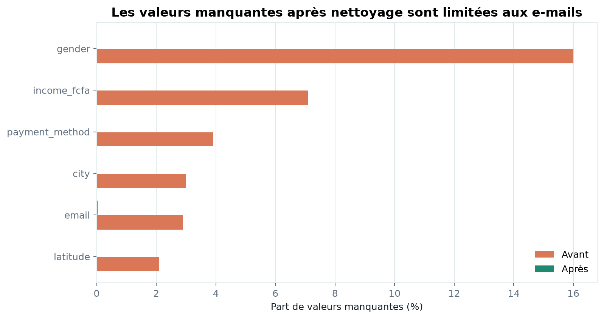
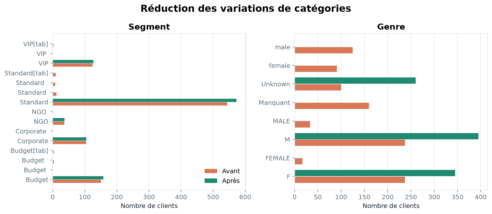
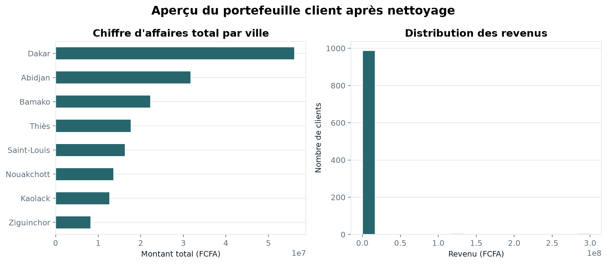

# Nettoyage de données clients e-commerce

Pipeline Python reproductible pour diagnostiquer, nettoyer et standardiser un fichier de clients e-commerce provenant de plusieurs villes d’Afrique de l’Ouest.

Le projet transforme un fichier brut de **1 000 clients et 20 colonnes** en un CSV exploitable pour l’analyse, tout en conservant une trace claire des choix de qualité de données.

## Résultats en un coup d’œil

| Indicateur | Résultat |
| --- | ---: |
| Lignes traitées | 1 000 |
| Colonnes | 20 |
| Doublons supprimés | 0 |
| Valeurs manquantes après traitement | 2,9 % sur `email` uniquement |
| Valeurs de `segment` | 15 variantes → 5 catégories |
| Valeurs de `gender` | 8 variantes → `M`, `F`, `Unknown` |
| Format de `is_member` | Booléen (`True` / `False`) |

Les adresses e-mail manquantes sont conservées. Les inventer créerait une information artificielle et empêcherait de distinguer une absence de donnée d’une donnée fiable.

## Aperçu visuel

### Valeurs manquantes avant et après



Les imputations réduisent les valeurs manquantes de `income_fcfa`, `city`, `gender`, `payment_method` et `latitude`. Seule la colonne `email` reste incomplète.

### Normalisation des catégories



Le nettoyage des espaces, tabulations et variantes de casse rend les catégories comparables sans modifier leur signification.

### Profil du portefeuille client



Cette vue fournit un aperçu du chiffre d’affaires par ville et de la distribution des revenus après traitement.

## Ce que fait le pipeline

Le script [`src/clean_customers.py`](src/clean_customers.py) applique une séquence déterministe :

1. charge le CSV source et mesure les valeurs manquantes ;
2. supprime les doublons exacts ;
3. nettoie les espaces et tabulations des colonnes textuelles ;
4. harmonise `segment` en conservant les acronymes `VIP` et `NGO` ;
5. normalise `gender` vers `M`, `F` ou `Unknown` ;
6. convertit `is_member` en booléen ;
7. corrige `Cote dIvoire` en `Côte d'Ivoire` ;
8. normalise les numéros sénégalais identifiables vers `+221XXXXXXXXX` ;
9. impute les valeurs numériques et catégorielles selon des règles explicites ;
10. exporte le résultat sans index.

Les figures du README sont produites par [`src/generate_figures.py`](src/generate_figures.py), à partir du fichier brut et du fichier nettoyé.

## Stratégies de traitement

| Colonne(s) | Règle appliquée |
| --- | --- |
| `income_fcfa` | Moyenne conditionnelle au genre, puis moyenne globale de secours |
| `city`, `payment_method` | Valeur modale |
| `latitude` | Médiane |
| `email` | Aucune imputation |
| `segment`, `gender` | Nettoyage textuel et mapping explicite |
| `phone` | Conversion seulement lorsque le format est identifiable |

Les téléphones trop courts ou ambigus sont conservés pour vérification manuelle plutôt que corrigés au hasard.

## Structure du projet

```text
senegal-customer-data-cleaning/
├── data/
│   ├── customers_clean.csv       # résultat généré
│   └── datasets_tp1.csv          # données brutes
├── outputs/
│   ├── figures/                  # figures générées pour la documentation
│   └── .gitkeep
├── src/
│   ├── clean_customers.py        # pipeline de nettoyage
│   └── generate_figures.py       # génération des visualisations
├── LICENSE
├── README.md
└── requirements.txt
```

## Installation

Le projet nécessite Python 3.10 ou supérieur, pandas et matplotlib.

```bash
git clone https://github.com/Adam01-i/senegal-customer-data-cleaning.git
cd senegal-customer-data-cleaning

python3 -m venv venv
source venv/bin/activate
python3 -m pip install -r requirements.txt
```

Sous Linux, utilisez `python3` si la commande `python` n’est pas disponible.

## Reproduire les résultats

### 1. Nettoyer les données

```bash
python3 src/clean_customers.py \
  --input data/datasets_tp1.csv \
  --output data/customers_clean.csv
```

### 2. Générer les figures

```bash
python3 src/generate_figures.py \
  --input data/datasets_tp1.csv \
  --clean data/customers_clean.csv \
  --output-dir outputs/figures
```

Le dossier de sortie est créé automatiquement s’il n’existe pas.

## Schéma des données

| Domaine | Colonnes |
| --- | --- |
| Identification | `id`, `customer_id` |
| Profil | `age`, `gender`, `city`, `country`, `segment` |
| Commandes | `product_category`, `quantity`, `unit_price_fcfa`, `total_amount_fcfa` |
| Dates | `signup_date`, `last_purchase_date` |
| Contact | `email`, `phone` |
| Paiement et fidélité | `payment_method`, `is_member` |
| Géolocalisation | `latitude`, `longitude` |
| Revenus | `income_fcfa` |

## Limites et prochaines étapes

- ajouter des tests automatisés pour chaque règle de normalisation ;
- valider les téléphones selon le pays, et pas uniquement selon le préfixe sénégalais ;
- produire un rapport de qualité au format JSON ou HTML ;
- figer les versions des dépendances pour une reproductibilité stricte ;
- externaliser les mappings dans un fichier de configuration.

## Contexte

Projet réalisé dans le cadre d’un TP de data cleaning en Master 1 Système d’Information. Il illustre l’imputation, la normalisation textuelle et le contrôle de la qualité de données sur un cas e-commerce ouest-africain.

## Licence

Projet distribué sous licence MIT. Voir [`LICENSE`](LICENSE).